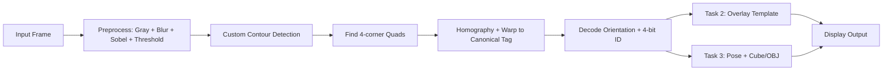
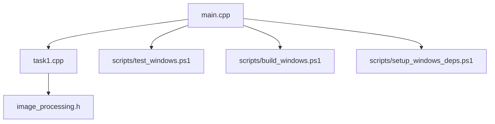

# Beginner Guide (Windows) - How This AR Tag Project Works

This guide is for a first-year CS student who wants to understand the code step by step.

## 1) Big Picture
The program reads a video/webcam frame, finds AR tags, decodes their ID/orientation, and draws AR content (2D image + 3D object).



Rendered image:


## 2) Code Map (Where to Read First)



Rendered image:


- `main.cpp`: program flow and runtime loop.
- `task1.cpp`: custom computer-vision functions (core logic).
- `image_processing.h`: function declarations.
- `scripts/*.ps1`: Windows setup/build/test helpers.

Recommended reading order:
1. `main.cpp` (understand pipeline control)
2. `image_processing.h` (see available custom functions)
3. `task1.cpp` (dive into implementation)

## 3) Frame-by-Frame Pipeline
1. Convert RGB to grayscale (`rgbToGray`).
2. Smooth image (`custom_blur_separable`).
3. Detect edges (`sobel_edge_detection`).
4. Convert to binary (`custom_threshold`).
5. Trace contours (`detect_contours`).
6. Simplify to polygons (`rdp_simplify`), keep valid quads.
7. Sort corners (`custom_sort_corners`).
8. Compute custom homography (`custom_compute_homography`).
9. Warp to normalized square (`custom_warp_perspective`).
10. Decode tag (`decode_ar_tag_8x8`).
11. If valid tag:
   - Task 2: overlay template image.
   - Task 3: estimate pose and render cube/OBJ.

## 4) How Tag Decoding Works


Rendered image:


Key idea:
- Orientation marker tells how the tag is rotated.
- Center 2x2 cells store ID bits.

## 5) 3D AR (Task 3) in Simple Terms
From tag corners:
1. Compute homography from tag plane to image.
2. Use camera intrinsics `K`.
3. Recover camera pose `(R, t)`.
4. Project 3D points (cube/OBJ) to 2D image pixels.
5. Draw lines to render object.

The code also smooths pose over time to reduce flicker.

## 6) Windows Setup, Build, and Test
Run in PowerShell from repo root:

```powershell
.\scripts\setup_windows_deps.ps1 -Install
.\scripts\build_windows.ps1
.\scripts\test_windows.ps1
```

Intrinsics note:
- `camera_intrinsics.yml` exists in the repo as an approximate default so Task 3 runs immediately.
- For accurate 3D alignment, regenerate `camera_intrinsics.yml` using chessboard calibration:
```bash
python3 scripts/calibrate_camera.py --source 0 --pattern 9x6 --min-frames 20 --output camera_intrinsics.yml
```

Extra examples:
```powershell
.\scripts\test_windows.ps1 -Source multipleTags.mp4
```

Optional full example (only if you downloaded these files):
```powershell
.\scripts\test_windows.ps1 -Source Tag0.mp4 -Template iitd_logo_template.jpg -Intrinsics camera_intrinsics.yml -Obj wolf.obj
```

## 7) How to Learn from This Code
- Start by printing one debug message per stage in `main.cpp`.
- Temporarily disable Task 2/Task 3 and verify only detection+ID first.
- Use one short video clip and pause often.
- Modify one parameter at a time (threshold, min area, smoothing alpha).

## 8) Important Constraint Reminder
This assignment requires custom implementations for processing steps.  
OpenCV high-level processing functions like built-in homography/warp/contour helpers should not be used for core logic.
